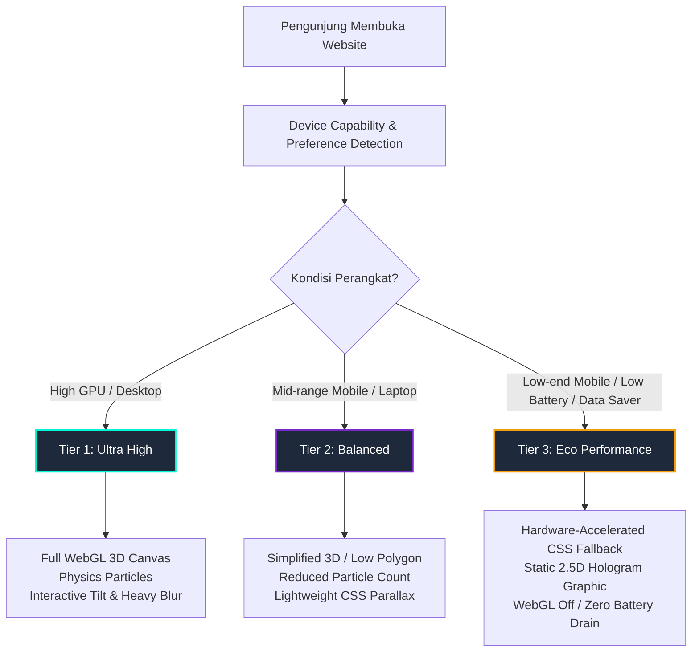
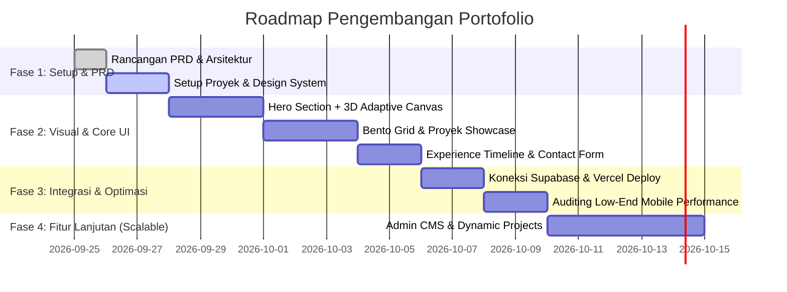

# Product Requirement Document (PRD) & Technical Blueprint
## Luxury Modern 3D Portfolio Website (Vercel + Supabase Ready)

---

## 1. Executive Summary & Vision

### 1.1 Visi Proyek
Membangun website portofolio personal kelas dunia (*high-end luxury aesthetic*) yang menggabungkan visual 3D modern, efek paralaks dinamis, dan tipografi prestisius, tanpa mengorbankan performa (*zero-jank, sub-second loading*). Website dirancang untuk tetap berjalan mulus (*smooth 60fps*) di semua spektrum perangkat, mulai dari smartphone *budget/low-end* hingga desktop berspesifikasi tinggi.

### 1.2 Pilar Utama
1. **Aesthetic Excellence ("Mahal & Modern")**: Visual gelap (*deep obsidian & titanium slate*) dengan sentuhan pencahayaan aurora halus (*subtle glassmorphism*, *radial cursor spotlights*, *micro-interactions*).
2. **Adaptive Performance (Low-End Mobile Friendly)**: Sistem adaptasi grafis dinamis (*Performance Tiering Engine*) yang mendeteksi kapabilitas perangkat dan otomatis menurunkan beban render WebGL/3D tanpa merusak estetika.
3. **Zero-Cost Production Ready**: 100% dapat di-deploy secara gratis di platform **Vercel** (Edge Network, CI/CD otomatis, SSL otomatis).
4. **Scalable Backend Integration**: Terintegrasi opsional dengan **Supabase** (PostgreSQL, Storage, Real-time) untuk *contact form*, *dynamic project management*, hingga analitik interaksi pengunjung.

---

## 2. Target Pengguna & Persona

| Persona | Kebutuhan Utama | Elemen Kunci yang Dilihat |
| :--- | :--- | :--- |
| **Tech Recruiter / HR** | Mencari ringkasan cepat, keahlian utama, resume download, riwayat kerja. | Navigasi cepat, waktu muat instan (< 1.5 detik), tombol CTA jelas, tautan LinkedIn/GitHub. |
| **Engineering Lead / CTO** | Menguji kualitas kode, arsitektur, perhatian terhadap detail, performa, dan responsivitas. | Optimasi multi-device, kehalusan animasi, detail teknis studi kasus (*tech stack breakdown*). |
| **Klien / Founder** | Mencari bukti nyata keahlian (*proof of work*), kesan profesionalisme dan rasa percaya tinggi. | Tampilan prestisius ("mahal"), demo interaktif, testimonial, form kontak yang responsif. |

---

## 3. Desain & Filosofi Visual ("Mahal & Modern")

```
┌─────────────────────────────────────────────────────────────┐
│ Visual Mood: "Executive Obsidian & Luminescent Glass"       │
├─────────────────────────────────────────────────────────────┤
│ • Latar Belakang: #070709 (Deep Space) / #0d0e12 (Obsidian) │
│ • Aksentuasi Glow: Cyan Aurora (#00f5d4), Violet (#7928ca),  │
│   atau Muted Champagne Gold (#f5d061 / #e2b714)             │
│ • Kontur / Border: 1px border tipis rgba(255,255,255, 0.08)  │
│   dengan interaksi hover kursor radial spotlight            │
│ • Tipografi: Plus Jakarta Sans / Inter (Body) + Space       │
│   Grotesk / Syne (Headings) + JetBrains Mono (Tech Tags)    │
│ • Material: Frosted Glass (backdrop-filter: blur(16px))     │
└─────────────────────────────────────────────────────────────┘
```

### 3.1 Detail Micro-Interactions & Efek 3D
- **Hero 3D Canvas**: Elemen 3D interaktif (misal: *abstract geometric luxury shape*, *floating particle wave*, atau *holographic orb*) yang merespons gerak kursor/gyroscope.
- **Dynamic Bento Grid**: Tata letak modern bergaya Bento UI untuk menampilkan *Tech Stacks, Featured Work, Highlights, dan Metrics*.
- **Magnetic Buttons & Dynamic Glow**: Tombol dengan efek gravitasi halus terhadap kursor dan border yang menyala mengikuti koordinat mouse.
- **Smooth Inertia Scroll & Parallax**: Lapisan visual paralaks berlapis dengan kedalaman z-index tanpa *layout thrashing*.

---

## 4. Strategi Performa & Multi-Device (Solusi Low-End Device)

Masalah umum website 3D adalah membuat ponsel *low-end* menjadi panas, lambat, atau bahkan *crash*. Berikut arsitektur solusi yang kita terapkan:



### 4.1 Mekanisme "Adaptive Quality Engine"
1. **Device & Network Sniffing**:
   - Mengecek `navigator.hardwareConcurrency` (jumlah core CPU).
   - Mengecek `navigator.deviceMemory` (RAM perangkat, jika didukung browser).
   - Mendeteksi `prefers-reduced-motion` untuk aksesibilitas.
   - Memantau FPS nyata di frame pertama; jika FPS < 35, otomatis menurunkan tier grafis.
2. **Intersection Observer Rendering**:
   - Canvas 3D hanya di-render saat terlihat di viewport (*pause rendering loop* saat user scroll melewati hero).
3. **CSS GPU Acceleration**:
   - Menggunakan `transform: translate3d()` dan `will-change` secara selektif agar animasi diproses langsung oleh GPU tanpa *reflow/repaint*.
4. **Manual Eco Mode Toggle**:
   - Memberikan tombol opsional di header/footer: *"Mode Performa: High 3D / Eco Battery Saver"* sehingga pengunjung memiliki kontrol penuh.

---

## 5. Arsitektur Teknologi (Tech Stack)

### 5.1 Frontend Core
- **Framework**: **Next.js 15 (App Router)** atau **Vite + React (TypeScript)**
  - *Rekomendasi Utama: Next.js + React*. Keuntungan: SSR/SSG untuk SEO optimal, Server Actions untuk keamanan kontak form, optimasi gambar otomatis (`next/image`), dan integrasi natif dengan Vercel.
- **Styling**: **Vanilla CSS / Modern CSS Modules + Tailwind CSS**
  - Menggunakan CSS variables untuk design token (warna, radius, blur, bayangan).
- **3D & Animasi**:
  - **Three.js** / **React Three Fiber (@react-three/fiber, @react-three/drei)** untuk objek 3D teroptimasi.
  - **Framer Motion** atau **GSAP (ScrollTrigger)** untuk transisi halaman dan efek scroll paralaks.
  - **Lucide Icons** untuk visual ikon yang tajam, ringan, dan modern.

### 5.2 Backend & Data Layer (Free Tier Supabase)
- **Supabase PostgreSQL**:
  - Tabel `inquiries`: Menyimpan pesan dari formulir kontak secara aman.
  - Tabel `projects`: Menyimpan daftar portofolio (memungkinkan penambahan proyek baru tanpa *re-deploy* website).
  - Tabel `analytics_views`: Menyimpan jumlah views dan reaksi (misal: "Applaud/Like") tanpa perlu tracking pihak ketiga yang berat.
- **Supabase Storage**:
  - Menyimpan aset sertifikat, resume/CV PDF, dan gambar portofolio dalam CDN cepat.

### 5.3 Deployment & Infrastruktur (Free Tier Vercel)
- **Hosting**: Vercel Global Edge Network.
- **CI/CD**: Otomatis *deploy preview* di setiap Git commit & push.
- **Environment Variables**: Manajemen kredensial API Supabase aman di dashboard Vercel.

---

## 6. Information Architecture & Halaman

```
[Navigation Bar]
  ├── Brand Logo / Monogram
  ├── Nav Links: About, Projects, Experience, Skills, Contact
  └── Controls: Theme Accent Switcher + Eco Mode Toggle + Resume CTA

1. [Hero Section]
   ├── Status Badge: "🟢 Available for Opportunities / Freelance"
   ├── Main Hook & Big Typography (e.g. "Crafting High-Performance Digital Experiences")
   ├── 3D Interactive Canvas (Adaptive: WebGL 3D Orb / Ambient Glow)
   ├── Quick Social Links (GitHub, LinkedIn, Email, X)
   └── Primary CTA ("View Projects") & Secondary CTA ("Let's Talk")

2. [Bento Showcase / About Matrix]
   ├── Mini Bio & Filosofi Desain/Coding
   ├── Dynamic Metrics (Years of Exp, Projects Completed, Code Quality)
   ├── Interactive Tech Stack Radar / Grid (Categorized: Frontend, Backend, Tools)
   └── Currently Learning / Experimenting Widget

3. [Featured Projects (Case Studies)]
   ├── Filter Tab (All, Web App, Mobile, Open Source, UI/UX)
   ├── 3D Interactive Project Cards (Tilt effect, live demo link, github repo link)
   ├── Key Highlights: Problem Solved, Tech Used, Architecture Diagram / Gallery
   └── Modal Detail / Live Preview Frame

4. [Experience & Timeline Journey]
   ├── Interactive vertical timeline dengan efek paralaks
   ├── Company / Client / Education milestones
   └── Tech tag badges & key contributions

5. [Interactive Lab / Playground (Opsional)]
   ├── Eksperimen micro-interaction, shader effect, atau mini tools untuk memukau tech recruiter.

6. [Contact & Guestbook Section (Supabase Connected)]
   ├── Contact Form dengan validasi anti-spam / honeypot
   ├── Direct WhatsApp / Email quick copy
   └── Interactive "Leave a Message / Guestbook" (Opsional fitur interaktif kekinian)

7. [Footer]
   ├── Copyright & Tech Stack Info ("Built with Next.js, Three.js & Supabase")
   ├── Realtime Local Time indicator (e.g., "Jakarta, ID — 21:55 WIB")
   └── Back to Top smooth scroll button
```

---

## 7. Skalabilitas & Roadmap Pengembangan



- **Fase 1 (MVP Statis Super Cepat)**:
  - Bangun kerangka website dengan Next.js / React + Tailwind/CSS Modules.
  - Implementasikan Hero 3D, Bento Grid, Proyek, dan Kontak Form.
  - Sempurnakan Adaptive Quality Engine untuk low-end mobile.
- **Fase 2 (Integrasi Supabase & Deployment)**:
  - Sambungkan form kontak ke Supabase table.
  - Deploy ke Vercel dan pasang custom domain (jika ada).
- **Fase 3 (Scalable Dynamic CMS)**:
  - Tambahkan autentikasi admin sederhana di Supabase untuk mengunggah proyek baru langsung dari dashboard tanpa edit kode.
  - Blog / Tech Articles engine (Markdown/MDX).

---

## 8. Metrik Keberhasilan (Acceptance Criteria)

1. **Lighthouse Performance Score**:
   - Desktop: **95 - 100**
   - Mobile: **90+** (bahkan dengan efek 3D aktif atau fallback adaptif).
2. **First Contentful Paint (FCP)**: < 1.0 detik.
3. **Largest Contentful Paint (LCP)**: < 2.0 detik.
4. **Cumulative Layout Shift (CLS)**: 0 (Tidak ada elemen yang melompat saat render).
5. **Responsivitas**: Tampilan rapi dari layar 320px (smartphone kecil) hingga 4K Ultra-wide monitor.
6. **Zero Cost**: Biaya operasional $0/bulan memanfaatkan free tier Vercel & Supabase.
